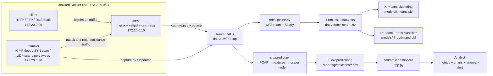

# NetFlow Analyzer — End-to-End Network Traffic Analysis Pipeline

<p align="center">
  <strong>Layer 3 / Layer 4 network traffic analysis, flow reconstruction, machine learning classification and interactive Streamlit visualization.</strong>
</p>

<p align="center">
  
  
  
  
  
</p>

---

## 1. Project Description

Modern network traffic is increasingly encrypted, high-volume and heterogeneous. Traditional payload-based inspection is often expensive, privacy-invasive or impossible when traffic is encrypted.

**NetFlow Analyzer** addresses that problem by analyzing network behavior without inspecting packet payloads. The project captures PCAP files in an isolated Docker network, reconstructs bidirectional flows, extracts Layer 3 and Layer 4 features, applies machine learning models for traffic classification and anomaly detection, and visualizes the results in an interactive Streamlit dashboard.

The project focuses on behavioral and protocol-level indicators:

- Flow duration.
- Packet and byte counts.
- Directional asymmetry.
- TCP flag behavior.
- Inter-arrival time.
- Estimated RTT.
- TCP window statistics.
- SYN/ACK ratio.
- Model confidence and anomaly probability.

The objective is not only to classify traffic correctly, but to build an explainable and reproducible pipeline where every feature can be justified from networking theory.

---

## 2. Architecture

The pipeline has five main stages:

1. Traffic generation in an isolated Docker lab.
2. Packet capture into PCAP files.
3. Flow reconstruction and feature extraction with NFStream and Scapy.
4. Machine learning with K-Means and Random Forest.
5. Interactive visualization with Streamlit and Plotly.

### 2.1 Architecture Diagram



### 2.2 Docker Lab

| Service | Role | Static IP |
|---|---|---:|
| `server` | Runs the target network services | `172.20.0.10` |
| `client` | Generates legitimate HTTP, FTP and DNS traffic | `172.20.0.20` |
| `attacker` | Generates attack and reconnaissance traffic | `172.20.0.30` |

The Docker network is internal and isolated from the real host network. This improves reproducibility and avoids capturing private real-world traffic.

---

## 3. Requirements

### 3.1 Recommended Environment

| Component | Recommended setup |
|---|---|
| Operating system | Windows 11 |
| Linux environment | WSL2 + Ubuntu 22.04 or newer |
| Python | Python 3.10+ |
| Docker | Docker Desktop with WSL2 integration |
| Packet tools | Wireshark, TShark, tcpdump, capinfos |
| Browser | Any modern browser for Streamlit |

### 3.2 Main Python Dependencies

The complete dependency list is stored in `requirements.txt`.

Main libraries:

| Layer | Tools |
|---|---|
| Packet processing | `scapy`, `pyshark`, `nfstream` |
| Data processing | `pandas`, `numpy`, `scipy` |
| Machine learning | `scikit-learn`, `imbalanced-learn`, `joblib` |
| Visualization | `streamlit`, `plotly`, `altair`, `matplotlib`, `seaborn` |
| Notebooks | `jupyter`, `ipykernel` |

---

## 4. Installation

### 4.1 Clone the repository

```bash
git clone https://github.com/angelperezcastro/CNC_Project.git
cd CNC_Project
```

### 4.2 Create and activate a virtual environment

```bash
python3 -m venv venv
source venv/bin/activate
```

### 4.3 Upgrade packaging tools

```bash
python -m pip install --upgrade pip setuptools wheel
```

### 4.4 Install dependencies

```bash
pip install -r requirements.txt
```

### 4.5 Verify Python imports

```bash
python - <<'PY'
import pandas
import numpy
import sklearn
import scapy
import nfstream
import streamlit
import plotly

print("Environment OK")
PY
```

### 4.6 Verify Docker from WSL

Docker Desktop must be running and WSL2 integration must be enabled.

```bash
which docker
docker version
docker compose version
```

If Docker is not available inside WSL2, enable it from Docker Desktop:

```text
Docker Desktop → Settings → Resources → WSL Integration → Enable Ubuntu → Apply & Restart
```

Then restart WSL from PowerShell:

```powershell
wsl --shutdown
```

---

## 5. Usage

### 5.1 Start the Docker traffic lab

```bash
docker compose up -d --build
docker compose ps
```

Expected services:

```text
server
client
attacker
```

Basic checks:

```bash
docker compose exec client curl -I http://server
docker compose exec client dig @server server.cnc.local +short
docker compose exec attacker nmap -n -sS -Pn -p 21,80 server
```

---

### 5.2 Generate labeled PCAP traffic

Short demo generation:

```bash
python src/generate_dataset.py \
  --duration 30 \
  --labels normal syn_scan udp_scan port_sweep \
  --tag week4_day3_demo
```

Full dataset generation:

```bash
python src/generate_dataset.py \
  --duration 600 \
  --labels normal icmp_flood syn_scan udp_scan port_sweep \
  --tag week1_final
```

Inspect generated PCAPs:

```bash
find data/raw -type f -name "*.pcap" -exec ls -lh {} \;
```

Raw PCAP files are ignored by Git because they can become large.

---

### 5.3 Generate traffic manually

Normal traffic:

```bash
docker compose exec client generate_normal.sh 60
```

Attack traffic:

```bash
docker compose exec attacker generate_attack.sh syn_scan server
docker compose exec attacker generate_attack.sh udp_scan server
docker compose exec attacker generate_attack.sh port_sweep
docker compose exec attacker generate_attack.sh icmp_flood server 5
```

The attack script restricts execution to the local lab target.

---

### 5.4 Capture traffic manually

Example normal capture:

```bash
python src/capture.py \
  --container server \
  --output data/raw/normal/manual_demo.pcap \
  --duration 60
```

Example attack capture:

```bash
python src/capture.py \
  --container attacker \
  --output data/raw/syn_scan/manual_syn_scan_demo.pcap \
  --duration 60
```

---

### 5.5 Extract flows and build datasets

The feature extraction pipeline combines:

- NFStream bidirectional flow reconstruction.
- Base L3/L4 statistics.
- Manual Scapy features.
- Cleaning and feature alignment.
- Scaling and artifact export.

Main files:

```text
src/pipeline.py
src/manual_features.py
src/prepare_dataset.py
```

Typical outputs:

```text
data/processed/dataset.csv
data/processed/dataset_scaled.csv
data/processed/cleaning_report.json
models/scaler.pkl
models/feature_columns.json
```

---

### 5.6 Machine Learning Workflow

The training and evaluation workflow is documented in:

```text
notebooks/03_clustering.ipynb
notebooks/04_classification.ipynb
docs/model_evaluation.md
```

Model artifacts:

```text
models/kmeans.pkl
models/rf_model.pkl
models/rf_optimized.pkl
models/scaler.pkl
models/label_encoder.pkl
models/feature_columns.json
```

---

### 5.7 Predict classes from a new PCAP

```bash
python src/predict.py data/test/mixed_day5.pcap \
  --output reports/predictions/mixed_day5_predictions.csv
```

The prediction pipeline performs:

1. PCAP normalization for NFStream compatibility.
2. Flow extraction.
3. Feature alignment with the training schema.
4. Scaling.
5. Random Forest prediction.
6. Anomaly flagging with `P(normal) < 0.4`.
7. CSV export.

---

### 5.8 Launch the Streamlit dashboard

```bash
streamlit run app.py
```

Open:

```text
http://localhost:8501
```

Dashboard features:

- PCAP / PCAPNG upload.
- Progress bar during analysis.
- Invalid PCAP detection.
- Total flows, normal flows and anomalous flows.
- Most frequent attack.
- Mean prediction confidence.
- Analysis time.
- Class distribution bar chart.
- Bytes vs duration scatter plot.
- Flow timeline.
- Class-filterable table.
- About section with model and feature details.

---

## 6. Feature Table

| Feature | Formula / source | Why it helps |
|---|---|---|
| `bidirectional_duration_ms` | Last packet timestamp minus first packet timestamp | Scans and floods often produce short flows; legitimate FTP/HTTP transfers can last longer. |
| `bidirectional_packets` | Total packets in both directions | Captures the volume of interaction inside a flow. |
| `bidirectional_bytes` | Total bytes in both directions | Distinguishes real data transfer from control-only probes. |
| `src2dst_bytes` / `dst2src_bytes` | Directional byte counts | Scans are often asymmetric because they send probes with little or no response. |
| `bytes_asymmetry_ratio` | Directional byte imbalance | Useful for identifying one-sided probing behavior. |
| `bidirectional_mean_ps` | Mean packet size | Control traffic and scans usually have small packets; data transfers approach larger packet sizes. |
| `bidirectional_packets_per_ms` | Packets divided by duration | High-rate traffic can reveal flood-like behavior. |
| TCP flag counts | SYN, ACK, RST, FIN, PSH counts | TCP scans have characteristic SYN/RST behavior and often do not complete normal sessions. |
| `syn_ack_ratio_manual` | SYN packets divided by ACK packets | A high ratio indicates incomplete handshakes, typical of half-open SYN scanning. |
| `iat_mean_ms` | Mean inter-arrival time | Automated traffic often has more regular timing than human/application traffic. |
| `iat_cv` | `std(IAT) / mean(IAT)` | Scale-independent timing variability; useful for floods and scans. |
| `rtt_estimate_ms` | SYN-ACK timestamp minus SYN timestamp | Valid only when a TCP handshake exists; missing RTT is informative for non-TCP or incomplete sessions. |
| TCP window statistics | Min, max, mean and variance of TCP window | Real TCP sessions can show window dynamics; simple scans often use fixed or low-variance values. |
| `protocol` / `protocol_name` | IP transport protocol | Separates TCP, UDP and ICMP behavior. |

The system deliberately avoids payload inspection. This keeps the analysis privacy-preserving and applicable to encrypted traffic at the behavioral level.

---

## 7. Results

### 7.1 Dataset Summary

| Label | Count | Percentage |
|---|---:|---:|
| `udp_scan` | 129 | 26.27% |
| `normal` | 129 | 26.27% |
| `syn_scan` | 129 | 26.27% |
| `icmp_flood` | 61 | 12.42% |
| `port_sweep` | 43 | 8.76% |

---

### 7.2 Random Forest Evaluation

| Metric | Value |
|---|---:|
| Train accuracy | 0.9796 |
| Test accuracy | 0.9697 |
| Train-test gap | 0.0099 |
| Weighted F1-score | 0.9689 |
| Mean 5-fold weighted F1 | 0.9676 |
| Std 5-fold weighted F1 | 0.0198 |

The train-test gap is below 5%, so there is no strong evidence of overfitting.

### Per-class metrics

| Class | Precision | Recall | F1-score | Support |
|---|---:|---:|---:|---:|
| `icmp_flood` | 0.9231 | 1.0000 | 0.9600 | 12 |
| `normal` | 1.0000 | 0.9615 | 0.9804 | 26 |
| `port_sweep` | 1.0000 | 0.7778 | 0.8750 | 9 |
| `syn_scan` | 0.9286 | 1.0000 | 0.9630 | 26 |
| `udp_scan` | 1.0000 | 1.0000 | 1.0000 | 26 |

### ROC-AUC one-vs-rest

| Class | ROC-AUC |
|---|---:|
| `icmp_flood` | 1.0000 |
| `normal` | 0.9989 |
| `port_sweep` | 0.9333 |
| `syn_scan` | 0.9887 |
| `udp_scan` | 1.0000 |

---

### 7.3 Error Analysis

The model produced only a small number of errors in the test split:

| True label | Predicted label | Count |
|---|---|---:|
| `port_sweep` | `syn_scan` | 2 |
| `normal` | `icmp_flood` | 1 |

From a security perspective, the most important result is that no attack flow was classified as `normal` in the evaluation split. The `port_sweep` errors were still classified as attack-like reconnaissance traffic.

The main limitation appears in the separation between different scan types. At the isolated flow level, a port sweep probe can look similar to a SYN scan because both can generate short, low-payload TCP flows with control-flag behavior.

---

### 7.4 Dashboard Demo Result

The final dashboard demo was validated with:

```text
data/test/week4_day3_docker_demo_mixed.pcap
```

Observed metrics:

| Metric | Value |
|---|---:|
| Total flows | 4025 |
| Normal flows | 26 |
| Anomalous flows | 3999 |
| Most frequent attack | `syn_scan` |
| Mean confidence | 94.16% |

Predicted class distribution:

| Predicted class | Flows |
|---|---:|
| `syn_scan` | 2923 |
| `udp_scan` | 973 |
| `port_sweep` | 86 |
| `normal` | 26 |
| `icmp_flood` | 17 |

### Dashboard screenshot


---

## 8. Design Decisions

### 8.1 Why Docker instead of real network traffic?

The project uses an isolated Docker network because it provides reproducibility, safety and control. Real network traffic can contain private data and is difficult to label accurately. Docker makes it possible to generate known normal and attack traffic classes while keeping the experiment separated from the host network.

### 8.2 Why L3/L4 features instead of payload inspection?

Payload inspection is increasingly limited by encryption and can raise privacy concerns. This project intentionally uses only Layer 3 and Layer 4 metadata: IPs, ports, protocol, byte counts, packet counts, timing and TCP flags. This makes the analysis compatible with encrypted traffic at the behavioral level.

### 8.3 Why NFStream plus Scapy?

NFStream is used for flow reconstruction because it provides bidirectional flow aggregation and many flow-level statistics out of the box. Scapy is used for manual packet-level features that require direct access to packet headers, such as inter-arrival time, estimated RTT, TCP window statistics and SYN/ACK ratio.

### 8.4 Why Random Forest?

Random Forest is a strong fit for this project because it handles heterogeneous tabular features, is robust to irrelevant variables, reduces overfitting compared with a single Decision Tree and provides feature importance for technical interpretation. The Decision Tree baseline achieved lower test accuracy and a larger train-test gap, confirming the benefit of the ensemble model.

### 8.5 Why Streamlit?

Streamlit allows the complete dashboard to be implemented in Python without building a separate frontend. This is appropriate for an academic project where the priority is to demonstrate the full analysis pipeline clearly and reproducibly.

---

## 9. Project Structure

```text
CNC_Project/
├── app.py
├── docker-compose.yml
├── docker/
│   ├── attacker/
│   ├── client/
│   └── server/
├── data/
│   ├── raw/
│   ├── interim/
│   ├── processed/
│   └── test/
├── docs/
├── models/
├── notebooks/
├── reports/
│   ├── figures/
│   └── predictions/
├── src/
│   ├── capture.py
│   ├── generate_dataset.py
│   ├── manual_features.py
│   ├── pipeline.py
│   ├── predict.py
│   ├── prepare_dataset.py
│   └── dashboard_adapter.py
└── requirements.txt
```

---

## 10. Reproducibility Notes

Raw PCAP files are ignored by Git because they can become very large. To reproduce the full workflow from a clean clone:

1. Install dependencies.
2. Start Docker Desktop with WSL2 integration.
3. Start the Docker Compose lab.
4. Generate PCAP files with `src/generate_dataset.py`.
5. Run feature extraction and ML notebooks if retraining is required.
6. Use `src/predict.py` or `app.py` to analyze new PCAPs.

---

## 11. Limitations

- The dataset is synthetic and generated in a controlled Docker lab.
- The model is trained on a limited set of traffic classes.
- The dashboard performs batch PCAP analysis, not real-time streaming.
- The model may not generalize to attack families not represented during training.
- Per-flow features can confuse similar scan types such as `port_sweep` and `syn_scan`.
- Temporal aggregation features over sliding windows are not yet implemented.

---

## 12. Future Work

Concrete improvements:

- Add temporal aggregation features:
  - `unique_dst_ports_per_src`
  - `unique_dst_hosts_per_src`
  - `connection_attempts_per_second`
  - `dst_port_entropy`
- Evaluate on public datasets such as CICIDS2017 or UNSW-NB15.
- Add a lightweight streaming mode with Kafka or a rolling PCAP watcher.
- Add model comparison with Gradient Boosting and calibrated probability estimates.
- Add automated tests for dashboard callbacks and invalid PCAP handling.
- Export dashboard reports as PDF or HTML.

---

## 13. Quick Command Reference

```bash
python3 -m venv venv
source venv/bin/activate
pip install -r requirements.txt

docker compose up -d --build
docker compose ps

python src/generate_dataset.py --duration 30 --labels normal syn_scan udp_scan port_sweep --tag week4_day3_demo

python src/predict.py data/test/mixed_day5.pcap --output reports/predictions/mixed_day5_predictions.csv

streamlit run app.py

docker compose down
```

---

## 14. Academic Context

This project was developed as an individual Computer Networks and Communications project. Its main goal is to demonstrate a complete and explainable network traffic analysis workflow, connecting packet-level networking concepts with machine learning and visualization.

