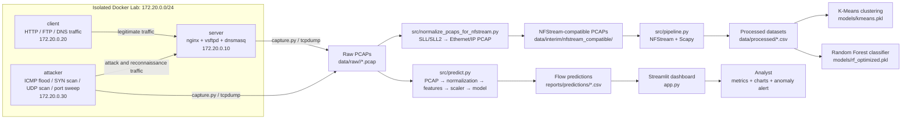
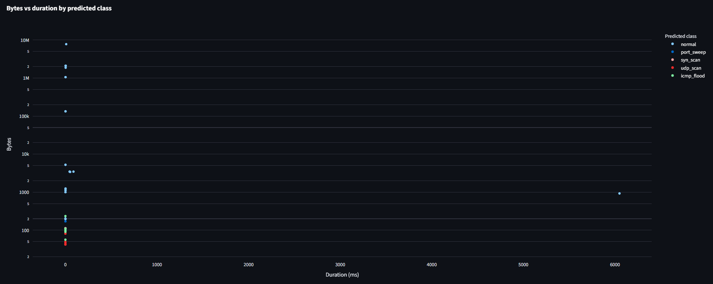

# NetFlow Analyzer — End-to-End Network Traffic Analysis Pipeline

<p align="center">
  <strong>Layer 3 / Layer 4 network traffic analysis, flow reconstruction, machine learning classification and interactive Streamlit visualization.</strong>
</p>

<p align="center">
  
  
  
  
  
</p>

---
# Presentation 
https://canva.link/g6idpluhmsl8ps6

---

## 1. Project Description

Modern network traffic is increasingly encrypted, high-volume and heterogeneous. Traditional payload-based inspection can be expensive, privacy-invasive or impossible when traffic is encrypted.

**NetFlow Analyzer** addresses that problem by analyzing network behavior without inspecting packet payloads. The project captures PCAP files in an isolated Docker network, reconstructs bidirectional flows, extracts Layer 3 and Layer 4 features, applies machine learning models for traffic classification and anomaly detection, and visualizes the results in an interactive Streamlit dashboard.

The project focuses on behavioral and protocol-level indicators:

- Flow duration.
- Packet and byte counts.
- Directional asymmetry.
- TCP flag behavior.
- Inter-arrival time.
- Estimated RTT.
- TCP window statistics.
- SYN/ACK ratio.
- Model confidence and anomaly probability.

The objective is not only to classify traffic correctly, but to build an explainable and reproducible pipeline where every feature can be justified from networking theory.

---

## 2. Architecture

The pipeline has five main stages:

1. Traffic generation in an isolated Docker lab.
2. Packet capture into PCAP files.
3. Flow reconstruction and feature extraction with NFStream and Scapy.
4. Machine learning with K-Means and Random Forest.
5. Interactive visualization with Streamlit and Plotly.

### 2.1 Architecture Diagram



### 2.2 Docker Lab

| Service | Role | Static IP |
|---|---|---:|
| `server` | Runs the target network services | `172.20.0.10` |
| `client` | Generates legitimate HTTP, FTP and DNS traffic | `172.20.0.20` |
| `attacker` | Generates attack and reconnaissance traffic | `172.20.0.30` |

The Docker network is internal and isolated from the real host network. This improves reproducibility and avoids capturing private real-world traffic.

---

## 3. Repository Data Policy

Raw packet captures are intentionally **not committed** to GitHub.

The repository `.gitignore` excludes:

```text
*.pcap
*.pcapng
*.cap
data/raw/
data/interim/
```

This decision is intentional because PCAP files can be large and may contain network metadata. A clean clone of the repository does not include raw captures. To reproduce the pipeline, generate new PCAP files using the Docker lab.

The repository does include the final processed artifacts and trained model files needed for prediction and dashboard usage:

```text
data/processed/dataset.csv
data/processed/dataset_scaled.csv
data/processed/cleaning_report.json
models/rf_optimized.pkl
models/kmeans.pkl
models/scaler.pkl
models/label_encoder.pkl
models/feature_columns.json
```

Therefore:

- **Prediction and dashboard usage do not require retraining.**
- **Retraining is only required if the dataset or feature engineering logic is changed.**
- **PCAP examples shown in this README must be generated locally before use.**

---

## 4. Requirements

### 4.1 Recommended Environment

| Component | Recommended setup |
|---|---|
| Operating system | Windows 11 |
| Linux environment | WSL2 + Ubuntu 22.04 or newer |
| Python | Python 3.10+ |
| Docker | Docker Desktop with WSL2 integration |
| Packet tools | Wireshark, TShark, tcpdump, capinfos |
| Browser | Any modern browser for Streamlit |

### 4.2 Main Python Dependencies

The complete dependency list is stored in `requirements.txt`.

Main libraries:

| Layer | Tools |
|---|---|
| Packet processing | `scapy`, `pyshark`, `nfstream` |
| Data processing | `pandas`, `numpy`, `scipy` |
| Machine learning | `scikit-learn`, `imbalanced-learn`, `joblib` |
| Visualization | `streamlit`, `plotly`, `altair`, `matplotlib`, `seaborn` |
| Notebooks | `jupyter`, `ipykernel` |

### 4.3 System Packages inside WSL2

Some scripts use packet-analysis tools such as `capinfos`, `tshark` or `tcpdump`.

Install them inside WSL2:

```bash
sudo apt update
sudo apt install -y tshark wireshark-common tcpdump
```

If Ubuntu asks whether non-superusers should be able to capture packets, either option is acceptable for this project because packet capture is mainly performed inside Docker containers.

---

## 5. Installation

### 5.1 Clone the Repository

```bash
git clone https://github.com/angelperezcastro/NetFlow-Analyzer.git
cd NetFlow-Analyzer
```

### 5.2 Create and Activate a Virtual Environment

```bash
python3 -m venv venv
source venv/bin/activate
```

### 5.3 Upgrade Packaging Tools

```bash
python -m pip install --upgrade pip setuptools wheel
```

### 5.4 Install Python Dependencies

```bash
pip install -r requirements.txt
```

### 5.5 Verify Python Imports

```bash
python - <<'PY'
import pandas
import numpy
import sklearn
import scapy
import nfstream
import streamlit
import plotly

print("Environment OK")
PY
```

### 5.6 Verify Docker from WSL2

Docker Desktop must be running and WSL2 integration must be enabled.

```bash
which docker
docker version
docker compose version
```

If Docker is not available inside WSL2, enable it from Docker Desktop:

```text
Docker Desktop → Settings → Resources → WSL Integration → Enable Ubuntu → Apply & Restart
```

Then restart WSL from PowerShell:

```powershell
wsl --shutdown
```

Open Ubuntu again and retry:

```bash
docker version
docker compose version
```

---

## 6. Quick Start

This is the shortest end-to-end demo path.

### 6.1 Start the Docker Lab

```bash
docker compose up -d --build
docker compose ps
```

Expected services:

```text
server
client
attacker
```

### 6.2 Generate a Small Local Demo PCAP

Because PCAP files are not stored in Git, generate one locally:

```bash
python src/generate_dataset.py \
  --duration 30 \
  --labels normal syn_scan udp_scan port_sweep \
  --tag readme_demo
```

This creates PCAP files under:

```text
data/raw/normal/
data/raw/syn_scan/
data/raw/udp_scan/
data/raw/port_sweep/
```

### 6.3 Run Prediction on a Generated PCAP

Example using the generated SYN scan capture:

```bash
python src/predict.py data/raw/syn_scan/syn_scan_readme_demo.pcap \
  --output reports/predictions/syn_scan_readme_demo_predictions.csv
```

The prediction script performs:

1. PCAP normalization for NFStream compatibility.
2. Flow extraction.
3. Feature alignment with the training schema.
4. Scaling.
5. Random Forest prediction.
6. Anomaly flagging with `P(normal) < 0.4`.
7. CSV export.

### 6.4 Launch the Dashboard

```bash
streamlit run app.py
```

Open:

```text
http://localhost:8501
```

Upload one of the generated `.pcap` files from `data/raw/<label>/` using the sidebar.

---

## 7. Full Reproducibility Workflow from a Clean Clone

The following sequence rebuilds the local PCAP dataset and feature datasets from scratch.

> Note: the trained model artifacts are already included in `models/`. Retraining is optional unless you modify the dataset or feature engineering code.

### 7.1 Environment Setup

```bash
python3 -m venv venv
source venv/bin/activate
python -m pip install --upgrade pip setuptools wheel
pip install -r requirements.txt
```

### 7.2 Start Docker Lab

```bash
docker compose up -d --build
docker compose ps
```

### 7.3 Generate Labeled PCAPs

Short reproducibility run:

```bash
python src/generate_dataset.py \
  --duration 60 \
  --labels normal icmp_flood syn_scan udp_scan port_sweep \
  --tag clean_clone_demo
```

Longer dataset generation:

```bash
python src/generate_dataset.py \
  --duration 600 \
  --labels normal icmp_flood syn_scan udp_scan port_sweep \
  --tag full_run
```

Inspect generated PCAPs:

```bash
find data/raw -type f -name "*.pcap" -exec ls -lh {} \;
```

### 7.4 Normalize PCAPs for NFStream

Some Docker/WSL captures use Linux cooked capture formats. Wireshark can read them, but NFStream may fail unless the link-layer header is normalized.

Run:

```bash
python src/normalize_pcaps_for_nfstream.py
```

Expected output directory:

```text
data/interim/nfstream_compatible/
```

This step preserves L3/L4 information and replaces only the layer-2 header with a synthetic Ethernet header. This is valid for this project because the model does not use MAC addresses or Ethernet-layer features.

### 7.5 Extract Flow Features

```bash
python src/pipeline.py \
  --input-dir data/interim/nfstream_compatible \
  --output data/processed/dataset_features_day4.csv \
  --errors-output data/processed/pipeline_errors_day4.csv \
  --summary-output data/processed/pipeline_day4_summary_by_label.csv
```

Expected outputs:

```text
data/processed/dataset_features_day4.csv
data/processed/pipeline_errors_day4.csv
data/processed/pipeline_day4_summary_by_label.csv
```

### 7.6 Clean, Balance and Scale the Dataset

```bash
python src/prepare_dataset.py
```

Expected outputs:

```text
data/processed/dataset_clean_unbalanced.csv
data/processed/dataset.csv
data/processed/dataset_scaled.csv
data/processed/cleaning_report.json
data/processed/outlier_clipping_report.csv
data/processed/class_balance_report.csv
data/processed/feature_stats_by_label.csv
models/scaler.pkl
```

### 7.7 Optional Retraining

The submitted repository already includes trained models. To retrain them, run the notebooks in order:

```text
notebooks/03_clustering.ipynb
notebooks/04_classification.ipynb
```

Main model artifacts:

```text
models/kmeans.pkl
models/rf_model.pkl
models/rf_optimized.pkl
models/scaler.pkl
models/label_encoder.pkl
models/feature_columns.json
```

### 7.8 Predict New Traffic

```bash
python src/predict.py data/raw/syn_scan/syn_scan_clean_clone_demo.pcap \
  --output reports/predictions/syn_scan_clean_clone_demo_predictions.csv
```

### 7.9 Start Dashboard

```bash
streamlit run app.py
```

---

## 8. Usage Details

### 8.1 Start the Docker Traffic Lab

```bash
docker compose up -d --build
docker compose ps
```

Basic checks:

```bash
docker compose exec client curl -I http://server
docker compose exec client dig @server server.cnc.local +short
docker compose exec attacker nmap -n -sS -Pn -p 21,80 server
```

---

### 8.2 Generate Labeled PCAP Traffic

Short demo generation:

```bash
python src/generate_dataset.py \
  --duration 30 \
  --labels normal syn_scan udp_scan port_sweep \
  --tag demo
```

Full dataset generation:

```bash
python src/generate_dataset.py \
  --duration 600 \
  --labels normal icmp_flood syn_scan udp_scan port_sweep \
  --tag week1_final
```

Inspect generated PCAPs:

```bash
find data/raw -type f -name "*.pcap" -exec ls -lh {} \;
```

Raw PCAP files are ignored by Git because they can become large.

---

### 8.3 Generate Traffic Manually

Normal traffic:

```bash
docker compose exec client generate_normal.sh 60
```

Attack traffic:

```bash
docker compose exec attacker generate_attack.sh syn_scan server
docker compose exec attacker generate_attack.sh udp_scan server
docker compose exec attacker generate_attack.sh port_sweep
docker compose exec attacker generate_attack.sh icmp_flood server 5
```

The attack script restricts execution to the local lab target.

---

### 8.4 Capture Traffic Manually

Example normal capture:

```bash
python src/capture.py \
  --container server \
  --output data/raw/normal/manual_demo.pcap \
  --duration 60
```

Example attack capture:

```bash
python src/capture.py \
  --container attacker \
  --output data/raw/syn_scan/manual_syn_scan_demo.pcap \
  --duration 60
```

---

### 8.5 Normalize PCAPs

Normalize all PCAPs under `data/raw/`:

```bash
python src/normalize_pcaps_for_nfstream.py
```

Expected output:

```text
data/interim/nfstream_compatible/<label>/<pcap_name>.pcap
```

---

### 8.6 Extract Flows and Build Feature Dataset

The feature extraction pipeline combines:

- NFStream bidirectional flow reconstruction.
- Base L3/L4 statistics.
- Manual Scapy features.
- Cleaning and feature alignment.
- Scaling and artifact export.

Main files:

```text
src/pipeline.py
src/manual_features.py
src/normalize_pcaps_for_nfstream.py
src/prepare_dataset.py
```

Run feature extraction:

```bash
python src/pipeline.py \
  --input-dir data/interim/nfstream_compatible \
  --output data/processed/dataset_features_day4.csv \
  --errors-output data/processed/pipeline_errors_day4.csv \
  --summary-output data/processed/pipeline_day4_summary_by_label.csv
```

Then clean, balance and scale:

```bash
python src/prepare_dataset.py
```

Typical outputs:

```text
data/processed/dataset_features_day4.csv
data/processed/dataset.csv
data/processed/dataset_scaled.csv
data/processed/cleaning_report.json
models/scaler.pkl
models/feature_columns.json
```

---

### 8.7 Machine Learning Workflow

The training and evaluation workflow is documented in:

```text
notebooks/03_clustering.ipynb
notebooks/04_classification.ipynb
docs/model_evaluation.md
```

Model artifacts:

```text
models/kmeans.pkl
models/rf_model.pkl
models/rf_optimized.pkl
models/scaler.pkl
models/label_encoder.pkl
models/feature_columns.json
```

The submitted model artifacts are already included, so prediction and dashboard analysis can be executed without retraining.

---

### 8.8 Predict Classes from a New PCAP

Use a PCAP generated locally:

```bash
python src/predict.py data/raw/syn_scan/syn_scan_readme_demo.pcap \
  --output reports/predictions/syn_scan_readme_demo_predictions.csv
```

Optional arguments:

```bash
python src/predict.py data/raw/syn_scan/syn_scan_readme_demo.pcap \
  --output reports/predictions/syn_scan_predictions.csv \
  --normal-threshold 0.4 \
  --max-packets-per-flow 10000
```

Disable PCAP normalization only if the PCAP is already NFStream-compatible:

```bash
python src/predict.py data/raw/syn_scan/syn_scan_readme_demo.pcap \
  --no-normalize
```

---

### 8.9 Launch the Streamlit Dashboard

```bash
streamlit run app.py
```

Open:

```text
http://localhost:8501
```

Dashboard features:

- PCAP / PCAPNG upload.
- Progress bar during analysis.
- Invalid PCAP detection.
- Total flows, normal flows and anomalous flows.
- Most frequent attack.
- Mean prediction confidence.
- Analysis time.
- Class distribution bar chart.
- Bytes vs duration scatter plot.
- Flow timeline.
- Class-filterable table.
- About section with model and feature details.

---

## 9. Feature Engineering

The system deliberately avoids payload inspection. This keeps the analysis privacy-preserving and applicable to encrypted traffic at the behavioral level.

| Feature | Formula / source | Why it helps |
|---|---|---|
| `bidirectional_duration_ms` | Last packet timestamp minus first packet timestamp | Scans and floods often produce short flows; legitimate FTP/HTTP transfers can last longer. |
| `bidirectional_packets` | Total packets in both directions | Captures the volume of interaction inside a flow. |
| `bidirectional_bytes` | Total bytes in both directions | Distinguishes real data transfer from control-only probes. |
| `src2dst_bytes` / `dst2src_bytes` | Directional byte counts | Scans are often asymmetric because they send probes with little or no response. |
| `bytes_asymmetry_ratio` | Directional byte imbalance | Useful for identifying one-sided probing behavior. |
| `packets_asymmetry_ratio` | Directional packet imbalance | Helps separate bidirectional sessions from one-sided reconnaissance flows. |
| `bidirectional_mean_ps` | Mean packet size | Control traffic and scans usually have small packets; data transfers approach larger packet sizes. |
| `bidirectional_packets_per_ms` | Packets divided by duration | High-rate traffic can reveal flood-like behavior. |
| TCP flag counts | SYN, ACK, RST, FIN, PSH counts | TCP scans have characteristic SYN/RST behavior and often do not complete normal sessions. |
| `syn_ack_ratio_manual` | SYN packets divided by ACK packets | A high ratio indicates incomplete handshakes, typical of half-open SYN scanning. |
| `iat_mean_ms` | Mean inter-arrival time | Automated traffic often has more regular timing than human/application traffic. |
| `iat_cv` | `std(IAT) / mean(IAT)` | Scale-independent timing variability; useful for floods and scans. |
| `rtt_estimate_ms` | SYN-ACK timestamp minus SYN timestamp | Valid only when a TCP handshake exists; missing RTT is informative for non-TCP or incomplete sessions. |
| TCP window statistics | Min, max, mean and variance of TCP window | Real TCP sessions can show window dynamics; simple scans often use fixed or low-variance values. |
| `protocol` / `protocol_name` | IP transport protocol | Separates TCP, UDP and ICMP behavior. |
| Missing indicators | Binary columns such as `rtt_estimate_ms_missing` | Missingness is meaningful because some protocols or incomplete handshakes cannot produce certain TCP features. |

### 9.1 NFStream + Scapy Design

The project uses a hybrid feature extraction approach:

- **NFStream** reconstructs bidirectional flows and provides base flow-level statistics.
- **Scapy** computes packet-level manual features that require direct access to packet headers.

This combination is useful because NFStream reduces the amount of custom flow aggregation code, while Scapy gives fine-grained access to TCP flags, timestamps and window fields.

---

## 10. Results

### 10.1 Dataset Summary

| Label | Count | Percentage |
|---|---:|---:|
| `udp_scan` | 129 | 26.27% |
| `normal` | 129 | 26.27% |
| `syn_scan` | 129 | 26.27% |
| `icmp_flood` | 61 | 12.42% |
| `port_sweep` | 43 | 8.76% |

The dataset is moderately imbalanced but controlled. The final cleaning stage applies balancing constraints to avoid excessive dominance by one class while preserving realistic differences between traffic types.

---

### 10.2 Random Forest Evaluation

| Metric | Value |
|---|---:|
| Train accuracy | 0.9796 |
| Test accuracy | 0.9697 |
| Train-test gap | 0.0099 |
| Weighted F1-score | 0.9689 |
| Mean 5-fold weighted F1 | 0.9676 |
| Std 5-fold weighted F1 | 0.0198 |

The train-test gap is below 5%, so there is no strong evidence of overfitting.

### 10.3 Per-Class Metrics

| Class | Precision | Recall | F1-score | Support |
|---|---:|---:|---:|---:|
| `icmp_flood` | 0.9231 | 1.0000 | 0.9600 | 12 |
| `normal` | 1.0000 | 0.9615 | 0.9804 | 26 |
| `port_sweep` | 1.0000 | 0.7778 | 0.8750 | 9 |
| `syn_scan` | 0.9286 | 1.0000 | 0.9630 | 26 |
| `udp_scan` | 1.0000 | 1.0000 | 1.0000 | 26 |

### 10.4 ROC-AUC One-vs-Rest

| Class | ROC-AUC |
|---|---:|
| `icmp_flood` | 1.0000 |
| `normal` | 0.9989 |
| `port_sweep` | 0.9333 |
| `syn_scan` | 0.9887 |
| `udp_scan` | 1.0000 |

---

### 10.5 Error Analysis

The model produced only a small number of errors in the test split:

| True label | Predicted label | Count |
|---|---|---:|
| `port_sweep` | `syn_scan` | 2 |
| `normal` | `icmp_flood` | 1 |

From a security perspective, the most important result is that no attack flow was classified as `normal` in the evaluation split. The `port_sweep` errors were still classified as attack-like reconnaissance traffic.

The main limitation appears in the separation between different scan types. At the isolated flow level, a port sweep probe can look similar to a SYN scan because both can generate short, low-payload TCP flows with control-flag behavior.

---

### 10.6 Dashboard Demo Result

The final dashboard demo was validated with a locally generated mixed PCAP.

Observed metrics:

| Metric | Value |
|---|---:|
| Total flows | 4025 |
| Normal flows | 26 |
| Anomalous flows | 3999 |
| Most frequent attack | `syn_scan` |
| Mean confidence | 94.16% |

Predicted class distribution:

| Predicted class | Flows |
|---|---:|
| `syn_scan` | 2923 |
| `udp_scan` | 973 |
| `port_sweep` | 86 |
| `normal` | 26 |
| `icmp_flood` | 17 |

### Dashboard Screenshot



---

## 11. Design Decisions

### 11.1 Why Docker Instead of Real Network Traffic?

The project uses an isolated Docker network because it provides reproducibility, safety and control. Real network traffic can contain private data and is difficult to label accurately. Docker makes it possible to generate known normal and attack traffic classes while keeping the experiment separated from the host network.

### 11.2 Why L3/L4 Features Instead of Payload Inspection?

Payload inspection is increasingly limited by encryption and can raise privacy concerns. This project intentionally uses only Layer 3 and Layer 4 metadata: IPs, ports, protocol, byte counts, packet counts, timing and TCP flags. This makes the analysis compatible with encrypted traffic at the behavioral level.

### 11.3 Why NFStream plus Scapy?

NFStream is used for flow reconstruction because it provides bidirectional flow aggregation and many flow-level statistics out of the box. Scapy is used for manual packet-level features that require direct access to packet headers, such as inter-arrival time, estimated RTT, TCP window statistics and SYN/ACK ratio.

### 11.4 Why PCAP Normalization?

Some PCAPs captured inside Docker or WSL use Linux cooked capture formats. These formats are readable by Wireshark but can be problematic for NFStream. The normalization step rewrites the layer-2 header as synthetic Ethernet while preserving the IP, TCP, UDP and ICMP layers. This is acceptable because the project only uses L3/L4 features.

### 11.5 Why Random Forest?

Random Forest is a strong fit for this project because it handles heterogeneous tabular features, is robust to irrelevant variables, reduces overfitting compared with a single Decision Tree and provides feature importance for technical interpretation. The Decision Tree baseline achieved lower test accuracy and a larger train-test gap, confirming the benefit of the ensemble model.

### 11.6 Why Streamlit?

Streamlit allows the complete dashboard to be implemented in Python without building a separate frontend. This is appropriate for an academic project where the priority is to demonstrate the full analysis pipeline clearly and reproducibly.

---

## 12. Project Structure

```text
CNC_Project/
├── app.py
├── docker-compose.yml
├── docker/
│   ├── attacker/
│   ├── client/
│   └── server/
├── data/
│   ├── raw/
│   ├── interim/
│   ├── processed/
│   └── test/
├── docs/
├── models/
├── notebooks/
├── reports/
│   ├── figures/
│   └── predictions/
├── src/
│   ├── capture.py
│   ├── dashboard_adapter.py
│   ├── generate_dataset.py
│   ├── manual_features.py
│   ├── normalize_pcaps_for_nfstream.py
│   ├── pipeline.py
│   ├── predict.py
│   └── prepare_dataset.py
└── requirements.txt
```

---

## 13. Troubleshooting

### 13.1 Docker Is Not Available Inside WSL2

Check:

```bash
docker version
```

If it fails, enable Docker Desktop WSL2 integration:

```text
Docker Desktop → Settings → Resources → WSL Integration → Enable Ubuntu → Apply & Restart
```

Then restart WSL:

```powershell
wsl --shutdown
```

---

### 13.2 `capinfos` Is Not Found

Install Wireshark command-line tools inside WSL2:

```bash
sudo apt update
sudo apt install -y tshark wireshark-common
```

Verify:

```bash
which capinfos
capinfos --version
```

---

### 13.3 NFStream Extracts No Flows

This often happens when the PCAP uses a link-layer format not supported by NFStream.

Run:

```bash
python src/normalize_pcaps_for_nfstream.py
```

Then process the normalized PCAPs:

```bash
python src/pipeline.py \
  --input-dir data/interim/nfstream_compatible
```

For prediction, `src/predict.py` normalizes the input PCAP by default.

---

### 13.4 The Example PCAP Does Not Exist

PCAP files are ignored by Git. Generate them locally first:

```bash
python src/generate_dataset.py \
  --duration 30 \
  --labels normal syn_scan udp_scan port_sweep \
  --tag readme_demo
```

Then run prediction:

```bash
python src/predict.py data/raw/syn_scan/syn_scan_readme_demo.pcap
```

---

### 13.5 Streamlit Starts but Prediction Fails

Check that model artifacts exist:

```bash
ls -lh models/
```

Expected files:

```text
rf_optimized.pkl
scaler.pkl
label_encoder.pkl
feature_columns.json
```

Also check that the uploaded file is a real `.pcap` or `.pcapng` file.

---

## 14. Security and Ethical Use

This repository generates traffic only inside a local isolated Docker lab. The attack scripts are designed for controlled educational experiments and should not be used against external networks or systems without explicit authorization.

The intended use cases are:

- Academic experimentation.
- Network traffic feature engineering.
- ML-based flow classification.
- Controlled anomaly detection demonstrations.

---

## 15. Limitations

- The dataset is synthetic and generated in a controlled Docker lab.
- The model is trained on a limited set of traffic classes.
- The dashboard performs batch PCAP analysis, not real-time streaming.
- The model may not generalize to attack families not represented during training.
- Per-flow features can confuse similar scan types such as `port_sweep` and `syn_scan`.
- Temporal aggregation features over sliding windows are not yet implemented.
- The system avoids payload inspection, so it cannot classify application content directly.
- The current model should be interpreted as an academic prototype, not as a production IDS.

---

## 16. Future Work

Concrete improvements:

- Add temporal aggregation features:
  - `unique_dst_ports_per_src`
  - `unique_dst_hosts_per_src`
  - `connection_attempts_per_second`
  - `dst_port_entropy`
- Evaluate on public datasets such as CICIDS2017 or UNSW-NB15.
- Add a lightweight streaming mode with Kafka or a rolling PCAP watcher.
- Add model comparison with Gradient Boosting and calibrated probability estimates.
- Add automated tests for dashboard callbacks and invalid PCAP handling.
- Export dashboard reports as PDF or HTML.
- Add CI checks for linting, import validation and smoke tests.
- Package the project with a `Makefile` or CLI wrapper for easier execution.

---

## 17. Quick Command Reference

### Environment

```bash
python3 -m venv venv
source venv/bin/activate
python -m pip install --upgrade pip setuptools wheel
pip install -r requirements.txt
```

### Docker Lab

```bash
docker compose up -d --build
docker compose ps
```

### Generate PCAPs

```bash
python src/generate_dataset.py \
  --duration 30 \
  --labels normal syn_scan udp_scan port_sweep \
  --tag readme_demo
```

### Normalize PCAPs

```bash
python src/normalize_pcaps_for_nfstream.py
```

### Extract Features

```bash
python src/pipeline.py \
  --input-dir data/interim/nfstream_compatible \
  --output data/processed/dataset_features_day4.csv \
  --errors-output data/processed/pipeline_errors_day4.csv \
  --summary-output data/processed/pipeline_day4_summary_by_label.csv
```

### Prepare Dataset

```bash
python src/prepare_dataset.py
```

### Predict New PCAP

```bash
python src/predict.py data/raw/syn_scan/syn_scan_readme_demo.pcap \
  --output reports/predictions/syn_scan_readme_demo_predictions.csv
```

### Launch Dashboard

```bash
streamlit run app.py
```

### Stop Docker Lab

```bash
docker compose down
```

---

## 18. Academic Context

This project was developed as an individual Computer Networks and Communications project. Its main goal is to demonstrate a complete and explainable network traffic analysis workflow, connecting packet-level networking concepts with machine learning and visualization.

The project emphasizes:

- Reproducibility.
- Safe traffic generation.
- L3/L4 feature engineering.
- Explainable ML decisions.
- Honest limitations.
- Professional documentation.
