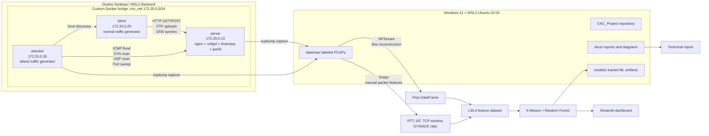

# Architecture Diagram

## Docker Lab and Data Pipeline

## Main Components

| Component | Role |
|---|---|
| server | Provides HTTP, FTP, DNS and iperf3 services for controlled traffic generation |
| client | Generates legitimate traffic such as HTTP, FTP and DNS |
| attacker | Generates anomalous traffic such as ICMP flood, SYN scan, UDP scan and port sweep |
| data/raw | Stores local PCAP files grouped by label |
| src/capture.py | Starts and stops tcpdump inside Docker containers |
| src/generate_dataset.py | Orchestrates traffic generation and capture by label |
| docs/dataset_stats.md | Records packet counts, durations and file sizes |
| Streamlit dashboard | Final interface for analyzing PCAPs and showing predictions |

## Data Flow

1. Docker containers generate controlled traffic inside the isolated bridge network.
2. tcpdump captures traffic from the relevant container.
3. PCAP files are saved locally under data/raw grouped by traffic label.
4. NFStream reconstructs flows and extracts base L3/L4 features.
5. Scapy computes manual packet-level features.
6. The ML pipeline trains clustering and classification models.
7. The dashboard visualizes classified flows and detected anomalies.
